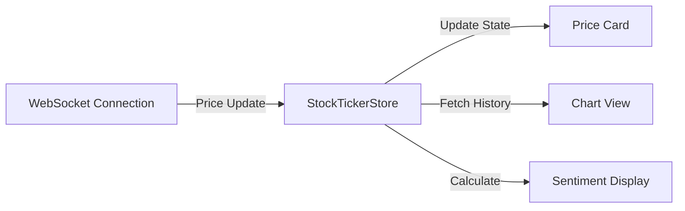
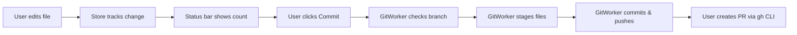
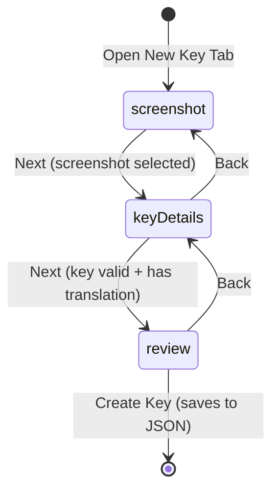
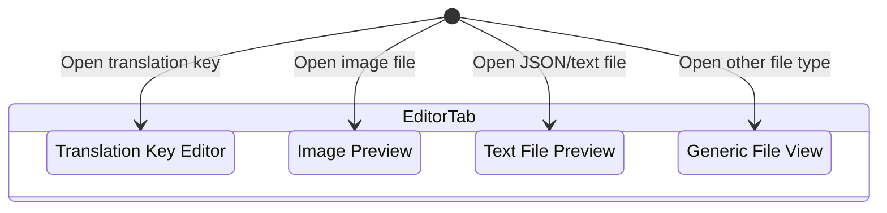
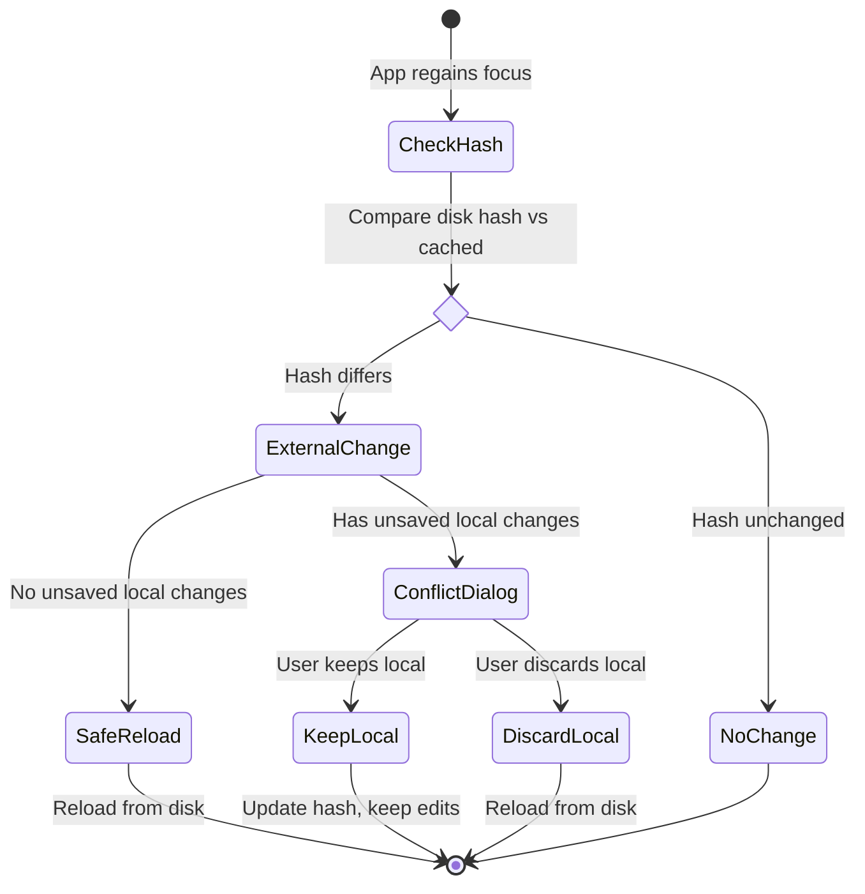

# DHBootlegToolkit

A macOS application providing integrated tools for stock market monitoring, localization management, and S3 feature configuration. Built with Swift 6, SwiftUI, and modern concurrency patterns.

## Overview

DHBootlegToolkit provides four integrated modules with shared Git workflow:

**Market Watch (Stock Ticker):**
- Real-time stock price tracking with WebSocket connections
- Dynamic sentiment analysis with adaptive thresholds
- Interactive charts with multiple time ranges (1D to All)
- Market statistics and trading hours display

**Localization Editor:**
- Feature-based navigation for translation keys organized by feature folders
- Multi-platform support for mobile and web localization files
- Multi-tab editor for translation keys, images, and text files
- New key wizard with screenshot attachment
- Fixed bottom toolbar with liquid glass styling for always-visible save/discard actions

**S3 Feature Config Editor:**
- Country-level configuration editing with search/filter
- Multi-environment support (staging/production)
- JSON schema validation
- Field promotion and bulk application across countries

**Logger:**
- Operation logs and timing information (placeholder for future implementation)

**Shared Capabilities:**
- Git integration - Create branches, commit changes, and open PRs directly
- External change detection with conflict resolution
- Native macOS window title bar integration

## Screenshots

<table>
  <tr>
    <td width="50%">
      
      <p align="center"><strong>Market Watch</strong> - Real-time stock tracking with memes</p>
    </td>
    <td width="50%">
      
      <p align="center"><strong>Not WebTranslateIt Editor</strong> - Goodbye WTI, a tribute to you</p>
    </td>
  </tr>
  <tr>
    <td width="50%">
      
      <p align="center"><strong>S3 Feature Config Editor</strong> - 6 years of manual editing, adios</p>
    </td>
    <td width="50%">
      
      <p align="center"><strong>S3 Feature Config Batch Update</strong> - Apply changes across multiple countries</p>
    </td>
  </tr>
</table>

## Getting Started

### Installation

Install via Homebrew Cask:

```bash
# Add the tap
brew tap lromyl/tap

# Install the cask
brew install --cask dhbootlegtoolkit

# Or in one command:
brew install --cask lromyl/tap/dhbootlegtoolkit
```

### Releases

Releases are fully automated via GitHub Actions. For maintainers creating releases, see [RELEASE.md](RELEASE.md) for the complete release process guide.

**Quick summary:**
- Releases are created via the GitHub UI
- GitHub Actions automatically builds, packages, and uploads the app
- Homebrew cask is automatically updated
- Users can upgrade via `brew upgrade --cask dhbootlegtoolkit`

**Latest releases:** https://github.com/lRoMYl/DHBootlegToolkit/releases

### Prerequisites (Building from Source)

- macOS 15+ (Sequoia)
- Xcode 16+
- [XcodeGen](https://github.com/yonaskolb/XcodeGen) for project generation
- GitHub CLI (`gh`) for PR creation

### Build Instructions

```bash
# Clone the repository
git clone <repo-url>
cd DHBootlegToolkit

# Generate Xcode project
xcodegen

# Open in Xcode
open DHBootlegToolkit.xcodeproj

# Or build from command line
xcodebuild -scheme DHBootlegToolkit build
```

### Repository Configuration

**Localization Editor** reads repository structure from `.localization-schema.json` in the repository root:

```json
{
  "basePath": "translations/project",
  "platforms": [
    { "id": "mobile", "folderName": "mobile", "displayName": "Mobile" },
    { "id": "web", "folderName": "web", "displayName": "Web" }
  ],
  "primaryLanguageFile": "en.json",
  "assetsFolderName": "images",
  "protectedBranches": ["main", "master"],
  "keyValidationPattern": "^[A-Za-z][A-Za-z0-9_]*$"
}
```

**S3 Feature Config Editor** uses a hardcoded configuration in `S3RepositoryConfiguration.swift`:
- Base path: `static.fd-api.com/s3root/feature-config`
- Discovers country folders containing `config.json` files
- Supports staging/production environment toggle

---

## Architecture

### Core Library (DHBootlegToolkitCore)

A reusable Swift Package providing business logic, located at `DHBootlegToolkitCore/`.

#### Workers (Thread-safe Actors)

| Worker | Purpose |
|--------|---------|
| `GitWorker` | Git operations: branch, commit, push, status parsing |
| `FileSystemWorker` | File I/O with order-preserving JSON serialization |
| `DiffWorker` | Compute diffs between HEAD and working directory |
| `ExternalChangeWorker` | Detect external file modifications via hash comparison |
| `S3JSONSerializer` | S3 config JSON encoding/decoding |

#### Models

| Model | Purpose |
|-------|---------|
| `FeatureFolder`, `TranslationEntity` | Localization data structures |
| `S3CountryConfig`, `S3Environment` | S3 feature config data structures |
| `StockData`, `StockSymbol` | Stock market data structures |
| `GitStatus`, `GitFileStatus` | Git state representation |
| `EntityDiff`, `EntityChangeStatus` | Change tracking for diff display |

#### Configuration

| Component | Purpose |
|-----------|---------|
| `RepositoryConfiguration` | Protocol defining repository layout |
| `EntitySchema` | JSON schema definitions for validation |
| `ConfigurationLoader` | Parses `.localization-schema.json` |

---

## App Modules

The application contains four main modules, accessible via sidebar tabs.

### Market Watch (Stock Ticker)

**Location:** `DHBootlegToolkit/Views/StockTicker/`
**State Container:** `StockTickerStore.swift`

Real-time stock market monitoring with sentiment analysis.

**Key Features:**
- Real-time price tracking via WebSocket connections
- Dynamic sentiment thresholds based on historical volatility
- Interactive price charts with 11 time ranges (1D, 1W, 1M, 3M, 6M, YTD, 1Y, 2Y, 5Y, 10Y, All)
- Market statistics grid (open, high, low, volume, P/E, market cap)
- Trading hours display with market status indicator
- Sentiment categories: Moonshot 🚀, Gains 📈, Flat 😐, Losses 📉, Crash 💥

**Key Files:**
| File | Purpose |
|------|---------|
| `StockTickerDetailView.swift` | Main detail view with price card, thresholds, and charts |
| `StockPriceCard.swift` | Price display with trading hours and connection status |
| `SentimentThresholdLegend.swift` | Dynamic threshold display with color indicators |
| `StockChartView.swift` | Interactive Swift Charts implementation with range selection |
| `MarketStatsGrid.swift` | Market statistics display |
| `StockTickerBrowserView.swift` | Sidebar stock list navigation |

**Chart Features:**
- Hover to inspect price at specific time
- Drag to select range and view change statistics
- Smooth catmull-rom interpolation
- Adaptive axis labels based on time range
- Color-coded sentiment overlay on range selection


### Localization Editor

**Location:** `DHBootlegToolkit/Views/LocalizationEditor/`
**State Container:** `AppStore.swift` (~1600 lines)

Edit translation keys for mobile and web platforms.

**Key Features:**
- Multi-tab editor supporting translation keys, images, and text files
- New key wizard flow: screenshot → key details → review
- Platform selection (mobile/web) per feature
- External change detection with conflict resolution dialogs
- File-level git status badges (`[A]` Added, `[M]` Modified, `[-]` Deleted)
- Fixed bottom toolbar with liquid glass styling for always-visible save/discard buttons

**Key Files:**
| File | Purpose |
|------|---------|
| `DetailTabView.swift` | Multi-tab container with new key wizard |
| `TranslationDetailView.swift` | Individual translation key editor with fixed toolbar |
| `TranslationListView.swift` | List of translation keys per feature |
| `TextTabView.swift` | Text/JSON file previewer |
| `ImageTabView.swift` | Image preview viewer |

**UI Improvements:**
- `.ultraThinMaterial` background for liquid glass toolbar effect
- Prominent save button with glow shadow when enabled
- Keyboard shortcut (⌘S) for quick save
- Bottom padding to prevent content from being hidden behind toolbar


### S3 Feature Config Editor

**Location:** `DHBootlegToolkit/Views/S3FeatureConfigEditor/`
**State Container:** `S3Store.swift`

Edit feature configuration stored in S3 JSON format.

**Key Features:**
- Multi-environment support (staging/production toggle)
- Country-level configuration editing with search/filter
- JSON schema validation
- Field promotion across environments
- Apply field values across multiple countries simultaneously

**Key Files:**
| File | Purpose |
|------|---------|
| `S3DetailView.swift` | Main S3 config editor |
| `S3BrowserView.swift` | Country/environment navigator |
| `JSONTreeView.swift` | Hierarchical JSON tree editor |
| `S3PromotionSheet.swift` | Promote configs between environments |
| `S3ApplyFieldSheet.swift` | Apply field across countries |


**Batch Update Feature:**


---

## UI Structure

```
DHBootlegToolkitApp (@main entry)
    └── MainSplitView (NavigationSplitView - 3 pane layout)
        ├── Sidebar (left column)
        │   └── SidebarView
        │       ├── Tab: .stockTicker → StockTickerBrowserView
        │       │   └── Stock list with live prices
        │       ├── Tab: .editor → FeatureBrowserView
        │       │   └── Feature tree with file items and git badges
        │       ├── Tab: .s3Editor → S3BrowserView
        │       │   └── Country list with environment toggle
        │       └── Tab: .logs → LogsPlaceholderView
        │           └── Coming soon placeholder
        │
        ├── Detail (center/right) - Title changes based on module
        │   ├── When .stockTicker: StockTickerDetailView
        │   │   └── Price card, sentiment thresholds, charts
        │   ├── When .editor: DetailTabView
        │   │   └── Multi-tab translation key editing
        │   ├── When .s3Editor: S3DetailView
        │   │   └── JSON tree editor for configs
        │   └── When .logs: LogsPlaceholderView
        │       └── Empty state
        │
        └── GitStatusBar (bottom toolbar, shared)
            ├── Branch selector dropdown
            ├── Git user info display
            ├── Uncommitted changes count
            └── Create PR / Publish button
```

### Native Window Title Integration

The app uses native macOS window title bar with dynamic titles:
- **Market Watch** - Stock Ticker module
- **Not WebTranslateIt Editor** - Localization module
- **S3 Feature Config Editor** - S3 Config module
- **Logger** - Logs module

### View Hierarchy

| View | Location | Purpose |
|------|----------|---------|
| `MainSplitView` | `Views/MainSplitView.swift` | Primary 3-pane layout with git bar |
| `SidebarView` | `Views/Sidebar/SidebarView.swift` | Tab navigation and module switching |
| `StockTickerBrowserView` | `Views/StockTicker/Sidebar/` | Stock list for market watch |
| `FeatureBrowserView` | `Views/LocalizationEditor/` | Feature tree for localization |
| `S3BrowserView` | `Views/S3FeatureConfigEditor/` | Country list for S3 configs |

---

## Stock Ticker Architecture

### Real-Time Data Flow



### Sentiment Calculation

**Dynamic Thresholds:**
Based on historical volatility calculated from price data:

```swift
volatility = standardDeviation(returns) * volatilityMultiplier
```

**Sentiment Categories:**
- **Moonshot** 🚀: Change ≥ +moonshot threshold (e.g., +5%)
- **Gains** 📈: Between +gainsLower and +moonshot
- **Flat** 😐: Within ±flat range
- **Losses** 📉: Between -lossesLower and -flatLower
- **Crash** 💥: Change ≤ crash threshold (e.g., -5%)

**Threshold Source:**
- **Fixed**: Baseline thresholds (±5%, ±1%, ±0.5%)
- **Dynamic**: Adjusted based on 3-month volatility ratio

### Chart Time Ranges

| Range | X-Axis Stride | X-Axis Format | Use Case |
|-------|---------------|---------------|----------|
| 1D | Hour | Hour (HH:00) | Intraday trading |
| 1W | Day | Weekday (Mon, Tue) | Weekly patterns |
| 1M | Week | Day (16, 23, 30) | Monthly trends |
| 3M/6M | Month | Month + Day (Jan 15) | Quarterly analysis |
| YTD/1Y | Month | Month (Jan, Feb) | Yearly performance |
| 2Y+ | Year | Year (2024, 2025) | Long-term trends |

---

## Git Integration

### Git Status Bar

Located in `MainSplitView.swift`, shared across all modules.

**Displays:**
- Current branch name with dropdown selector
- Git user name and email
- Count of uncommitted changes

**Actions:**
- Switch branches (with unsaved changes protection)
- Create new branch from current
- Commit changes with auto-generated message
- Publish PR via GitHub CLI

### Git Worker

**Location:** `DHBootlegToolkitCore/Workers/GitWorker.swift`

Actor-based worker ensuring thread-safe git operations.

**Operations:**
```swift
func getCurrentBranch() async throws -> String
func createBranch(_ name: String) async throws
func checkout(_ branch: String) async throws
func commit(message: String, files: [URL]) async throws
func push() async throws
func getStatus() async throws -> GitStatus
```

**Status Parsing:**
Parses `git status --porcelain` output to determine file states:
- `??` or `A` → Added
- `M` or `R` → Modified
- `D` → Deleted

### Git Flow



---

## State Machines

### WizardStep (New Translation Key Flow)

Location: `DHBootlegToolkit/Views/LocalizationEditor/DetailTabView.swift`



**States:**
- `screenshot` - Add reference screenshot for the translation
- `keyDetails` - Enter key name, translation text, notes, character limit
- `review` - Preview and confirm before saving

### EditorTab (Multi-Tab System)

Location: `DHBootlegToolkit/Models/EditorTab.swift`



Each tab variant carries its own data payload (`KeyTabData`, `ImageTabData`, etc.) with feature context.

### External Change Detection Flow

Location: `DHBootlegToolkit/ViewModels/AppStore.swift`



---

## Project Structure

```
DHBootlegToolkit/
├── DHBootlegToolkitCore/                    # Reusable Swift Package
│   ├── Package.swift
│   └── Sources/DHBootlegToolkitCore/
│       ├── Workers/                         # GitWorker, FileSystemWorker, DiffWorker
│       ├── Models/                          # FeatureFolder, TranslationEntity, StockData
│       └── Configuration/                   # RepositoryConfiguration, EntitySchema
│
├── DHBootlegToolkit/                        # macOS SwiftUI App
│   ├── App/DHBootlegToolkitApp.swift        # @main entry point
│   ├── ViewModels/                          # View State containers
│   ├── Views/                               # Views
│   │   ├── MainSplitView.swift              # Primary layout + git bar
│   │   ├── Components/                      # Shared components (GitStatusBar, etc.)
│   │   ├── Sidebar/                         # SidebarView with 4 tabs
│   │   ├── StockTicker/                     # Stock Ticker module
│   │   ├── LocalizationEditor/              # Localization Editor module
│   │   └── S3FeatureConfigEditor/           # S3 Config Editor module
│   └── Models/                              # EditorTab, LogEntry
│
├── DHBootlegToolkitTests/                   # Unit tests
├── project.yml                              # XcodeGen configuration
```

---

## For Developers

### Code Conventions

- **Swift 6** with strict concurrency checking
- **Actors** for thread-safe workers (`GitWorker`, `FileSystemWorker`, `DiffWorker`)
- **@Observable** pattern for SwiftUI state management
- **Protocol-based configuration** for extensibility
- **Nonisolated methods** where parallel execution is safe
- **Native macOS UI patterns** (liquid glass, materials, toolbars)

### Key Patterns

**Actor-based Workers:**
```swift
public actor GitWorker {
    private let repositoryURL: URL

    public func getCurrentBranch() async throws -> String {
        try await runCommand(executable: "/usr/bin/git", arguments: ["branch", "--show-current"])
    }
}
```

**Order-preserving JSON:**
The `FileSystemWorker` manually builds JSON to preserve key order, which is important for readable diffs in version control.

**External Change Detection:**
File hashes (prefix + suffix + length) are cached and compared on app focus to detect concurrent edits.

### Testing

```bash
# Run Core package tests
cd DHBootlegToolkitCore
swift test

# Run app tests via Xcode
xcodebuild test -scheme DHBootlegToolkitTests
```

---

## License

This project is licensed under the MIT License - see the [LICENSE](LICENSE) file for details.
