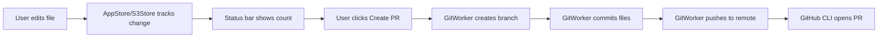
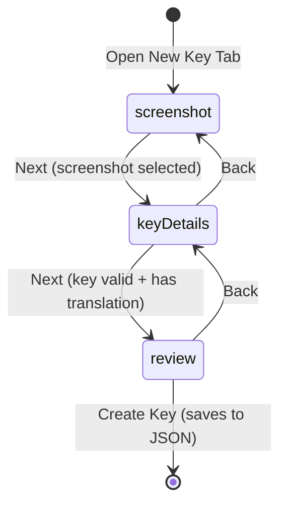
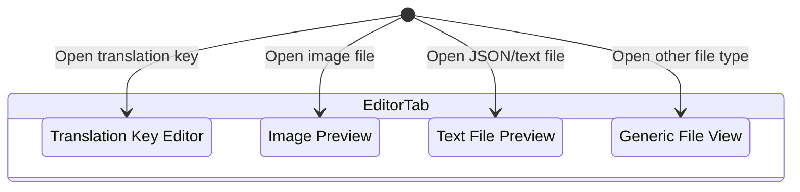
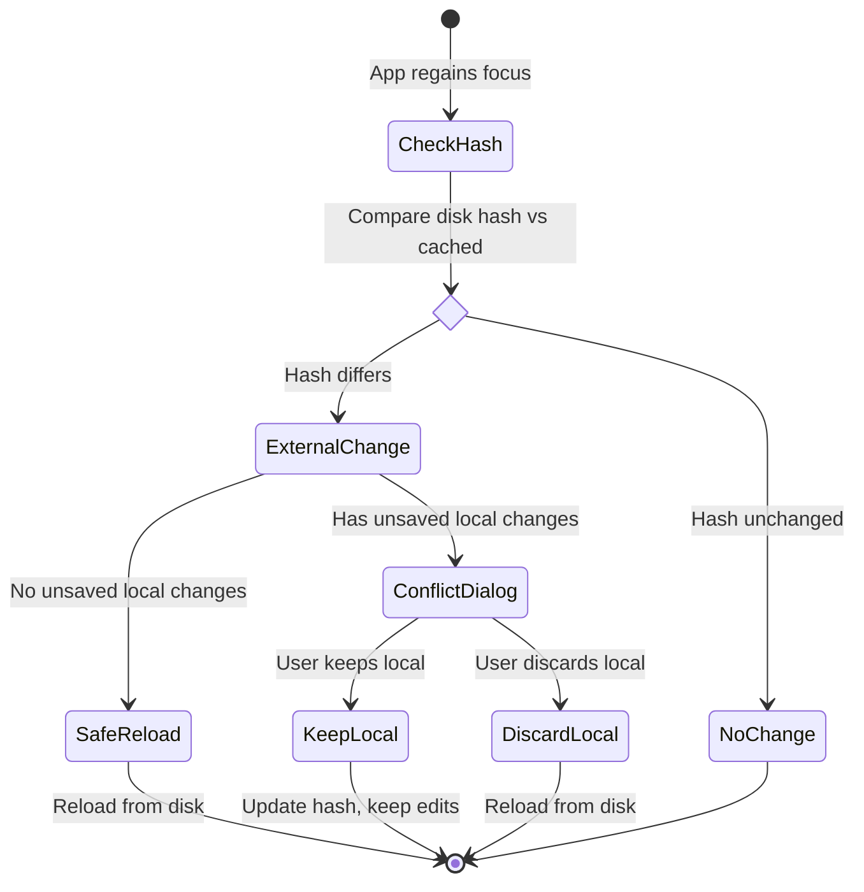

# DHBootlegToolkit

A macOS application for managing translation keys and S3 feature configuration. Built with Swift 6, SwiftUI, and modern concurrency patterns.

## Overview

DHBootlegToolkit provides two integrated editor modules with shared Git workflow:

**Localization Editor:**
- Feature-based navigation for translation keys organized by feature folders
- Multi-platform support for mobile and web localization files
- Multi-tab editor for translation keys, images, and text files
- New key wizard with screenshot attachment

**S3 Feature Config Editor:**
- Country-level configuration editing with search/filter
- Multi-environment support (staging/production)
- JSON schema validation
- Field promotion and bulk application across countries

**Shared Capabilities:**
- Git integration - Create branches, commit changes, and open PRs directly
- External change detection with conflict resolution

## Getting Started

### Prerequisites

- macOS 15+ (Sequoia)
- Xcode 16+
- [XcodeGen](https://github.com/yonaskolb/XcodeGen) for project generation
- GitHub CLI (`gh`) for PR creation

### Build Instructions

```bash
# Clone the repository
git clone <repo-url>
cd DHBootlegToolkit

# Generate Xcode project
xcodegen

# Open in Xcode
open DHBootlegToolkit.xcodeproj

# Or build from command line
xcodebuild -scheme DHBootlegToolkit build
```

### Repository Configuration

**Localization Editor** reads repository structure from `.localization-schema.json` in the repository root:

```json
{
  "basePath": "translations/project",
  "platforms": [
    { "id": "mobile", "folderName": "mobile", "displayName": "Mobile" },
    { "id": "web", "folderName": "web", "displayName": "Web" }
  ],
  "primaryLanguageFile": "en.json",
  "assetsFolderName": "images",
  "protectedBranches": ["main", "master"],
  "keyValidationPattern": "^[A-Za-z][A-Za-z0-9_]*$"
}
```

**S3 Feature Config Editor** uses a hardcoded configuration in `S3RepositoryConfiguration.swift`:
- Base path: `static.fd-api.com/s3root/feature-config`
- Discovers country folders containing `config.json` files
- Supports staging/production environment toggle

---

## Architecture

### Core Library (DHBootlegToolkitCore)

A reusable Swift Package providing business logic, located at `DHBootlegToolkitCore/`.

#### Workers (Thread-safe Actors)

| Worker | Purpose |
|--------|---------|
| `GitWorker` | Git operations: branch, commit, push, status parsing |
| `FileSystemWorker` | File I/O with order-preserving JSON serialization |
| `DiffWorker` | Compute diffs between HEAD and working directory |
| `ExternalChangeWorker` | Detect external file modifications via hash comparison |
| `S3JSONSerializer` | S3 config JSON encoding/decoding |

#### Models

| Model | Purpose |
|-------|---------|
| `FeatureFolder`, `TranslationEntity` | Localization data structures |
| `S3CountryConfig`, `S3Environment` | S3 feature config data structures |
| `GitStatus`, `GitFileStatus` | Git state representation |
| `EntityDiff`, `EntityChangeStatus` | Change tracking for diff display |

#### Configuration

| Component | Purpose |
|-----------|---------|
| `RepositoryConfiguration` | Protocol defining repository layout |
| `EntitySchema` | JSON schema definitions for validation |
| `ConfigurationLoader` | Parses `.localization-schema.json` |

---

## App Modules

The application contains two main editor modules, accessible via sidebar tabs.

### Localization Editor

**Location:** `DHBootlegToolkit/Views/Editor/`
**State Container:** `AppStore.swift` (~1600 lines)

Edit translation keys for mobile and web platforms.

**Key Features:**
- Multi-tab editor supporting translation keys, images, and text files
- New key wizard flow: screenshot → key details → review
- Platform selection (mobile/web) per feature
- External change detection with conflict resolution dialogs
- File-level git status badges (`[A]` Added, `[M]` Modified, `[-]` Deleted)

**Key Files:**
| File | Purpose |
|------|---------|
| `DetailTabView.swift` | Multi-tab container with new key wizard |
| `TranslationDetailView.swift` | Individual translation key editor |
| `TranslationListView.swift` | List of translation keys per feature |
| `TextTabView.swift` | Text/JSON file previewer |
| `ImageTabView.swift` | Image preview viewer |

### S3 Feature Config Editor

**Location:** `DHBootlegToolkit/Views/S3Editor/`
**State Container:** `S3Store.swift`

Edit feature configuration stored in S3 JSON format.

**Key Features:**
- Multi-environment support (staging/production toggle)
- Country-level configuration editing with search/filter
- JSON schema validation
- Field promotion across environments
- Apply field values across multiple countries simultaneously

**Key Files:**
| File | Purpose |
|------|---------|
| `S3DetailView.swift` | Main S3 config editor |
| `S3BrowserView.swift` | Country/environment navigator |
| `JSONTreeView.swift` | Hierarchical JSON tree editor |
| `S3PromotionSheet.swift` | Promote configs between environments |
| `S3ApplyFieldSheet.swift` | Apply field across countries |

---

## UI Structure

```
DHBootlegToolkitApp (@main entry)
    └── MainSplitView (NavigationSplitView - 3 pane layout)
        ├── Sidebar (left column)
        │   └── SidebarView
        │       ├── Tab: .editor → FeatureBrowserView
        │       │   └── Feature tree with file items and git badges
        │       ├── Tab: .s3Editor → S3BrowserView
        │       │   └── Country list with environment toggle
        │       └── Tab: .logs → LogsView
        │           └── Operation logs and timing
        │
        ├── Detail (center/right)
        │   ├── When .editor: DetailTabView
        │   │   └── Multi-tab translation key editing
        │   └── When .s3Editor: S3DetailView
        │       └── JSON tree editor for configs
        │
        └── GitStatusBar (bottom toolbar, shared)
            ├── Branch selector dropdown
            ├── Git user info display
            ├── Uncommitted changes count
            └── Create PR / Publish button
```

### View Hierarchy

| View | Location | Purpose |
|------|----------|---------|
| `MainSplitView` | `Views/MainSplitView.swift` | Primary 3-pane layout with git bar |
| `SidebarView` | `Views/Sidebar/SidebarView.swift` | Tab navigation and module switching |
| `FeatureBrowserView` | `Views/Sidebar/FeatureBrowserView.swift` | Feature tree for localization |
| `S3BrowserView` | `Views/S3Editor/S3BrowserView.swift` | Country list for S3 configs |

---

## Git Integration

### Git Status Bar

Located in `MainSplitView.swift`, shared across both modules.

**Displays:**
- Current branch name with dropdown selector
- Git user name and email
- Count of uncommitted changes

**Actions:**
- Switch branches (with unsaved changes protection)
- Create new branch from current
- Publish PR via GitHub CLI

### Git Worker

**Location:** `DHBootlegToolkitCore/Workers/GitWorker.swift`

Actor-based worker ensuring thread-safe git operations.

**Operations:**
```swift
func getCurrentBranch() async throws -> String
func createBranch(_ name: String) async throws
func checkout(_ branch: String) async throws
func commit(message: String, files: [URL]) async throws
func push() async throws
func getStatus() async throws -> GitStatus
```

**Status Parsing:**
Parses `git status --porcelain` output to determine file states:
- `??` or `A` → Added
- `M` or `R` → Modified
- `D` → Deleted

### Git Flow



---

## State Machines

### WizardStep (New Translation Key Flow)

Location: `DHBootlegToolkit/Views/Editor/DetailTabView.swift`



**States:**
- `screenshot` - Add reference screenshot for the translation
- `keyDetails` - Enter key name, translation text, notes, character limit
- `review` - Preview and confirm before saving

### EditorTab (Multi-Tab System)

Location: `DHBootlegToolkit/Models/EditorTab.swift`



Each tab variant carries its own data payload (`KeyTabData`, `ImageTabData`, etc.) with feature context.

### External Change Detection Flow

Location: `DHBootlegToolkit/ViewModels/AppStore.swift`



---

## Project Structure

```
DHBootlegToolkit/
├── DHBootlegToolkitCore/                    # Reusable Swift Package
│   ├── Package.swift
│   └── Sources/DHBootlegToolkitCore/
│       ├── Workers/                       # GitWorker, FileSystemWorker, DiffWorker
│       ├── Models/                        # FeatureFolder, TranslationEntity, S3CountryConfig
│       └── Configuration/                 # RepositoryConfiguration, EntitySchema
│
├── DHBootlegToolkit/                    # macOS SwiftUI App
│   ├── App/DHBootlegToolkitApp.swift    # @main entry point
│   ├── ViewModels/                        # AppStore, S3Store, LogStore
│   ├── Views/
│   │   ├── MainSplitView.swift            # Primary layout + git bar
│   │   ├── Sidebar/                       # SidebarView, FeatureBrowserView
│   │   ├── Editor/                        # Localization Editor module
│   │   └── S3Editor/                      # S3 Feature Config Editor module
│   └── Models/                            # EditorTab, LogEntry
│
├── DHBootlegToolkitTests/               # Unit tests
├── project.yml                            # XcodeGen configuration
└── README.md
```

---

## For Developers

### Code Conventions

- **Swift 6** with strict concurrency checking
- **Actors** for thread-safe workers (`GitWorker`, `FileSystemWorker`, `DiffWorker`)
- **@Observable** pattern for SwiftUI state management
- **Protocol-based configuration** for extensibility
- **Nonisolated methods** where parallel execution is safe

### Key Patterns

**Actor-based Workers:**
```swift
public actor GitWorker {
    private let repositoryURL: URL

    public func getCurrentBranch() async throws -> String {
        try await runCommand(executable: "/usr/bin/git", arguments: ["branch", "--show-current"])
    }
}
```

**Order-preserving JSON:**
The `FileSystemWorker` manually builds JSON to preserve key order, which is important for readable diffs in version control.

**External Change Detection:**
File hashes (prefix + suffix + length) are cached and compared on app focus to detect concurrent edits.

### Testing

```bash
# Run Core package tests
cd DHBootlegToolkitCore
swift test

# Run app tests via Xcode
xcodebuild test -scheme DHBootlegToolkitTests
```

---

## License

This project is licensed under the MIT License - see the [LICENSE](LICENSE) file for details.
