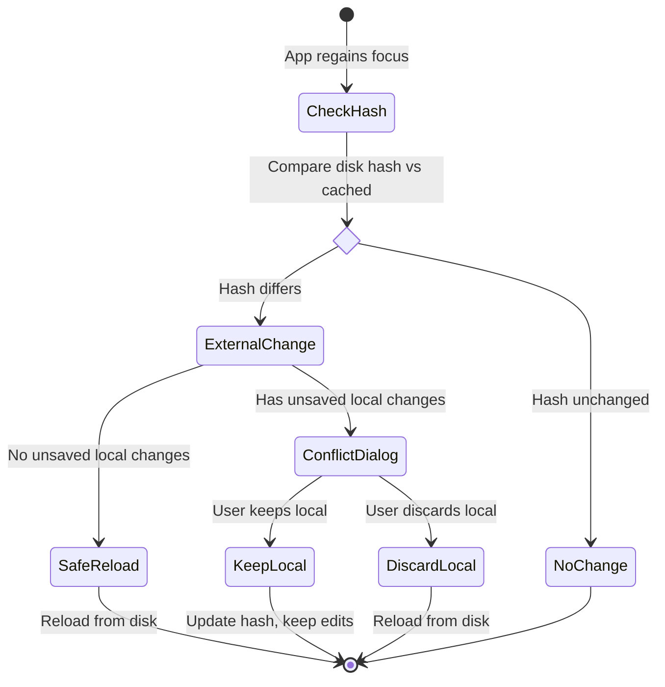

# Git Integration

> **Navigation:** [← Back to README](../README.md) | [Architecture](ARCHITECTURE.md) | [Modules](MODULES.md) | [Development](DEVELOPMENT.md)

This document describes the Git workflow implementation in DHBootlegToolkit.

## Table of Contents

- [Git Workflow Overview](#git-workflow-overview)
- [Git Status Bar](#git-status-bar)
- [Branch & Commit Operations](#branch--commit-operations)
- [Git Workers](#git-workers)
- [External Change Detection](#external-change-detection)

---

## Git Workflow Overview

DHBootlegToolkit provides integrated Git workflow across all modules (Localization Editor and S3 Config Editor). Users can create branches, commit changes, and open pull requests directly from the app.

### GitCore Package

Git operations are implemented in the **GitCore** package, separate from DHBootlegToolkitCore for modularity.

**Location:** `GitCore/`

**Key Components:**
- GitWorker (Git command execution)
- ProcessExecutor (Shell command runner)
- Git status parsing
- Branch management

### GitHub CLI Integration

The app uses GitHub CLI (`gh`) for creating pull requests:

```bash
gh pr create --base main --head feature-branch --title "PR Title"
```

**Requirements:**
- GitHub CLI installed: `brew install gh`
- Authenticated: `gh auth login`

---

## Git Status Bar

### Location

`MainSplitView.swift` - Bottom toolbar component

### Visibility

**IMPORTANT**: The Git status bar is hidden for:
- **Logger module** (`.logs`)
- **Stock Ticker module** (`.stockTicker`)

**Shown for:**
- Localization Editor (`.editor`)
- S3 Feature Config Editor (`.s3Editor`)

**Implementation:**
```swift
// MainSplitView.swift lines 70-73
if selectedTab != .logs && selectedTab != .stockTicker {
    GitStatusBar(store: store)
        .background(.ultraThinMaterial)
}
```

### Features

**Displays:**
- Current branch name with dropdown selector
- Git user name and email (from `git config`)
- Count of uncommitted changes
- Branch protection status

**Actions:**
- Switch branches (with unsaved changes protection)
- Create new branch from current
- Commit changes with auto-generated message
- Publish PR via GitHub CLI

### UI Components

```
┌─────────────────────────────────────────────────────┐
│ Branch: feature-branch ▼  │  User: John Doe        │
│                           │  Changes: 3            │
│                           │  [Create PR]           │
└─────────────────────────────────────────────────────┘
```

**Branch Dropdown:**
- Lists all local branches
- Shows current branch with checkmark
- Switch by clicking branch name

**Create PR Button:**
- Enabled when on feature branch with pushed commits
- Disabled on protected branches (main/master)
- Opens GitHub PR creation flow

---

## Branch & Commit Operations

### Creating Branches

**Flow:**
1. User clicks "New Branch" in git status bar
2. `CreateBranchSheet` appears
3. User enters branch name (validated)
4. GitWorker creates and checks out branch
5. Status bar updates to show new branch

**Branch Name Validation:**
- Must not be empty
- No special characters except `-` and `_`
- Cannot be a protected branch name (main/master)

**CreateBranchSheet UI Component:**
```swift
.sheet(isPresented: $showCreateBranch) {
    CreateBranchSheet(onCreateBranch: { branchName in
        await gitWorker.createBranch(branchName)
        await gitWorker.checkout(branchName)
    })
}
```

### Committing Changes

**Flow:**
1. User makes changes to files
2. Status bar shows uncommitted changes count
3. User clicks "Commit" button
4. `CommitSheet` appears with auto-generated message
5. User reviews and confirms
6. GitWorker stages files, commits, and pushes
7. Status bar updates

**Auto-Generated Commit Messages:**
- Analyzes changed files
- Generates descriptive message
- Format: "Update [module] - [action]"

**CommitSheet UI Component:**
```swift
.sheet(isPresented: $showCommit) {
    CommitSheet(
        files: modifiedFiles,
        suggestedMessage: generateCommitMessage(),
        onCommit: { message in
            await gitWorker.commit(message: message, files: modifiedFiles)
            await gitWorker.push()
        }
    )
}
```

### Opening Pull Requests

**Flow:**
1. User commits and pushes changes
2. "Create PR" button becomes enabled
3. User clicks "Create PR"
4. GitHub CLI opens PR creation in browser
5. User fills PR details on GitHub

**GitHub CLI Command:**
```bash
gh pr create --base main --head feature-branch --title "PR Title" --body "Description"
```

---

## Git Workers

### GitWorker (GitCore Package)

**Location:** `GitCore/Workers/GitWorker.swift`

Actor-based worker ensuring thread-safe Git operations.

**Key Operations:**
```swift
public actor GitWorker {
    private let repositoryURL: URL

    public func getCurrentBranch() async throws -> String
    public func createBranch(_ name: String) async throws
    public func checkout(_ branch: String) async throws
    public func commit(message: String, files: [URL]) async throws
    public func push() async throws
    public func getStatus() async throws -> GitStatus
    public func getBranches() async throws -> [String]
}
```

### GitWorker (DHBootlegToolkitCore)

**Location:** `DHBootlegToolkitCore/Workers/GitWorker.swift`

Alternative implementation in core package.

**Note:** The app primarily uses the GitCore package for Git operations, but maintains a worker in DHBootlegToolkitCore for compatibility.

### ProcessExecutor

**Location:** `DHBootlegToolkitCore/Workers/ProcessExecutor.swift`

Executes shell commands for Git operations.

**Implementation:**
```swift
public actor ProcessExecutor {
    public func runCommand(
        executable: String,
        arguments: [String],
        workingDirectory: URL? = nil
    ) async throws -> String {
        // Execute command and return output
    }
}
```

**Usage:**
```swift
let output = try await processExecutor.runCommand(
    executable: "/usr/bin/git",
    arguments: ["status", "--porcelain"],
    workingDirectory: repositoryURL
)
```

---

## External Change Detection

### Overview

DHBootlegToolkit detects when files are modified externally (by other tools or git operations) and prompts the user to reload or keep local changes.

### ExternalChangeWorker

**Location:** `DHBootlegToolkitCore/Workers/ExternalChangeWorker.swift`

**Purpose:** Detect external file modifications via hash comparison.

**Implementation:**
```swift
public actor ExternalChangeWorker {
    private var fileHashes: [URL: String] = [:]

    public func recordHash(for url: URL, data: Data) {
        let hash = calculateHash(data)
        fileHashes[url] = hash
    }

    public func hasExternalChange(for url: URL, currentData: Data) -> Bool {
        let currentHash = calculateHash(currentData)
        return fileHashes[url] != currentHash
    }

    private func calculateHash(_ data: Data) -> String {
        // Hash = prefix(1024) + suffix(1024) + length
        let prefix = data.prefix(1024)
        let suffix = data.suffix(1024)
        return "\(prefix.hashValue)-\(suffix.hashValue)-\(data.count)"
    }
}
```

### Detection Mechanism

**When Detection Occurs:**
- App regains focus (user switches back to app)
- File is about to be saved
- Periodic background checks

**Hash Calculation:**
- Prefix: First 1024 bytes
- Suffix: Last 1024 bytes
- Length: Total file size

**Why this approach:**
- Fast (no need to hash entire file)
- Detects most changes
- Efficient for large files

### Conflict Resolution Flow



### User Interaction

**Conflict Dialog:**
```
External Change Detected

The file "config.json" has been modified by another program.

Your local changes:
- Modified field "feature.enabled"
- Added field "feature.newOption"

Options:
┌───────────────┐  ┌──────────────┐
│ Keep Local    │  │ Reload from  │
│ Changes       │  │ Disk         │
└───────────────┘  └──────────────┘
```

**Safe Reload:**
If no unsaved local changes, automatically reload from disk without prompting.

### Implementation in AppStore

**Location:** `DHBootlegToolkit/ViewModels/AppStore.swift`

```swift
@Observable
class AppStore {
    private let externalChangeWorker: ExternalChangeWorker

    func checkForExternalChanges() async {
        for file in openFiles {
            let diskData = try await fileSystemWorker.readFile(at: file.url)
            if externalChangeWorker.hasExternalChange(for: file.url, currentData: diskData) {
                if file.hasUnsavedChanges {
                    showConflictDialog(for: file)
                } else {
                    reloadFile(file)
                }
            }
        }
    }

    func showConflictDialog(for file: EditorFile) {
        // Show dialog with options
    }
}
```

---

**Related Documentation:**
- [Architecture](ARCHITECTURE.md) - Technical architecture and patterns
- [Modules](MODULES.md) - Detailed module documentation
- [Development Guide](DEVELOPMENT.md) - Building and contributing
- [UI Structure](UI_STRUCTURE.md) - View hierarchy and components
- [State Management](STATE_MANAGEMENT.md) - State machines and patterns
