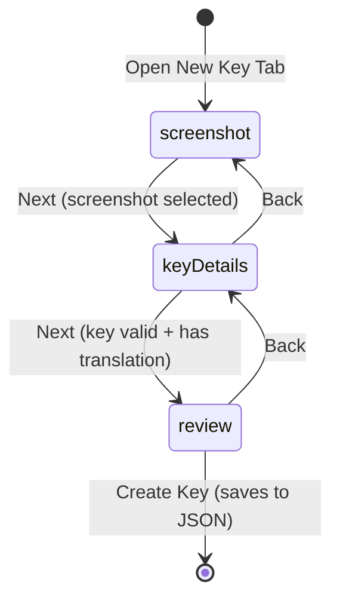
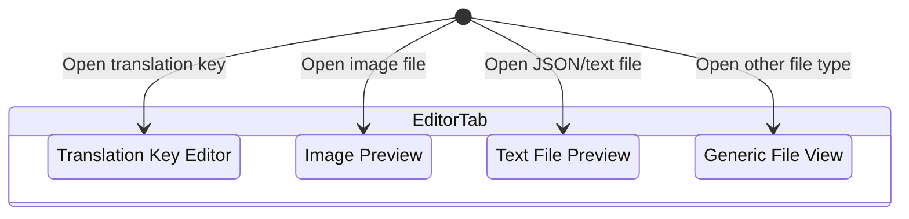
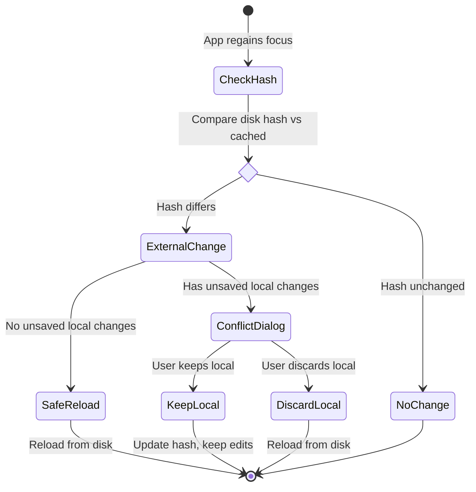

# State Management

> **Navigation:** [← Back to README](../README.md) | [Architecture](ARCHITECTURE.md) | [Modules](MODULES.md) | [Development](DEVELOPMENT.md)

This document describes the state management patterns and state machines used in DHBootlegToolkit.

## Table of Contents

- [State Management Overview](#state-management-overview)
- [State Machines](#state-machines)
- [Concurrency Patterns](#concurrency-patterns)
- [Data Flow](#data-flow)

---

## State Management Overview

DHBootlegToolkit uses SwiftUI's **@Observable** pattern for reactive state management across all modules.

### Observable Pattern

**View Models:**
```swift
@Observable
class AppStore {
    var selectedTab: EditorTab?
    var currentFeature: FeatureFolder?
    var uncommittedChanges: [URL] = []

    func loadFeature(_ folder: FeatureFolder) async {
        // Update state, SwiftUI auto-updates
    }
}
```

**View Binding:**
```swift
struct MyView: View {
    let store: AppStore

    var body: some View {
        Text(store.currentFeature?.name ?? "None")
        // Automatically updates when store.currentFeature changes
    }
}
```

### State Synchronization

State is synchronized between:
- **File System** - Disk-based JSON files
- **View Models** - In-memory state (@Observable)
- **UI** - SwiftUI views

**Flow:**
```
File System → FileSystemWorker → View Model → SwiftUI View
    ↑                                  ↓
    └──────────────────────────────────┘
         (Save changes back to disk)
```

---

## State Machines

### WizardStep (New Translation Key Flow)

**Location:** `DHBootlegToolkit/Views/LocalizationEditor/DetailTabView.swift`

The new translation key wizard follows a three-step state machine:



**States:**
- **screenshot** - Add reference screenshot for the translation
- **keyDetails** - Enter key name, translation text, notes, character limit
- **review** - Preview and confirm before saving

**State Transitions:**
```swift
enum WizardStep {
    case screenshot
    case keyDetails
    case review
}

@Observable
class WizardState {
    var currentStep: WizardStep = .screenshot
    var screenshot: UIImage?
    var keyName: String = ""
    var translation: String = ""

    func canProceedToDetails() -> Bool {
        screenshot != nil
    }

    func canProceedToReview() -> Bool {
        !keyName.isEmpty && !translation.isEmpty
    }
}
```

**UI Implementation:**
```swift
switch wizardState.currentStep {
case .screenshot:
    ScreenshotSelectionView(
        screenshot: $wizardState.screenshot,
        onNext: { wizardState.currentStep = .keyDetails }
    )
case .keyDetails:
    KeyDetailsView(
        keyName: $wizardState.keyName,
        translation: $wizardState.translation,
        onBack: { wizardState.currentStep = .screenshot },
        onNext: { wizardState.currentStep = .review }
    )
case .review:
    ReviewView(
        wizardState: wizardState,
        onBack: { wizardState.currentStep = .keyDetails },
        onCreate: { saveKey() }
    )
}
```

### EditorTab (Multi-Tab System)

**Location:** `DHBootlegToolkit/Models/EditorTab.swift`

The editor supports multiple tab types with different data payloads:



**Tab Variants:**
```swift
enum EditorTab: Identifiable {
    case key(KeyTabData)
    case image(ImageTabData)
    case textFile(TextFileTabData)
    case genericFile(GenericFileTabData)

    var id: String {
        switch self {
        case .key(let data): return "key-\(data.entityId)"
        case .image(let data): return "image-\(data.url)"
        case .textFile(let data): return "text-\(data.url)"
        case .genericFile(let data): return "file-\(data.url)"
        }
    }
}
```

**Data Payloads:**
```swift
struct KeyTabData {
    let entityId: String
    let feature: FeatureFolder
    var unsavedChanges: Bool
}

struct ImageTabData {
    let url: URL
    let feature: FeatureFolder
}

struct TextFileTabData {
    let url: URL
    let content: String
    let feature: FeatureFolder
}
```

**State Management:**
```swift
@Observable
class AppStore {
    var openTabs: [EditorTab] = []
    var selectedTab: EditorTab?

    func openTab(_ tab: EditorTab) {
        if !openTabs.contains(where: { $0.id == tab.id }) {
            openTabs.append(tab)
        }
        selectedTab = tab
    }

    func closeTab(_ tab: EditorTab) {
        openTabs.removeAll { $0.id == tab.id }
        if selectedTab?.id == tab.id {
            selectedTab = openTabs.first
        }
    }
}
```

### External Change Detection Flow

**Location:** `DHBootlegToolkit/ViewModels/AppStore.swift`

External change detection uses a state machine to handle conflicts:



**Implementation:**
```swift
@Observable
class AppStore {
    private let externalChangeWorker: ExternalChangeWorker
    var showConflictDialog: Bool = false
    var conflictFile: EditorFile?

    func checkExternalChanges() async {
        for file in openFiles {
            let diskData = try await fileSystemWorker.readFile(at: file.url)

            if externalChangeWorker.hasExternalChange(for: file.url, currentData: diskData) {
                if file.hasUnsavedChanges {
                    // Show conflict dialog
                    conflictFile = file
                    showConflictDialog = true
                } else {
                    // Safe to reload
                    await reloadFile(file)
                }
            }
        }
    }

    func keepLocalChanges() {
        guard let file = conflictFile else { return }
        // Update hash to prevent future conflicts
        externalChangeWorker.recordHash(for: file.url, data: file.localData)
        showConflictDialog = false
        conflictFile = nil
    }

    func discardLocalChanges() async {
        guard let file = conflictFile else { return }
        await reloadFile(file)
        showConflictDialog = false
        conflictFile = nil
    }
}
```

---

## Concurrency Patterns

### Actor Isolation

**Workers use actors for thread safety:**
```swift
public actor GitWorker {
    private var cache: [String: String] = [:]

    public func getCurrentBranch() async throws -> String {
        // Thread-safe execution
    }
}
```

**Nonisolated for parallel reads:**
```swift
public actor FileSystemWorker {
    nonisolated public func fileExists(at url: URL) -> Bool {
        // Safe to call from any thread
        FileManager.default.fileExists(atPath: url.path)
    }
}
```

### MainActor Usage

**UI State:**
```swift
@MainActor
@Observable
class AppStore {
    var selectedTab: EditorTab?

    func updateUI() {
        // Guaranteed to run on main thread
    }
}
```

**View Updates:**
```swift
struct MyView: View {
    let store: AppStore

    var body: some View {
        Text(store.selectedTab?.name ?? "None")
            .task {
                // Background work
                await loadData()

                // UI update on main thread
                await MainActor.run {
                    store.selectedTab = newTab
                }
            }
    }
}
```

### Async/Await Patterns

**Sequential Operations:**
```swift
func saveAndCommit() async throws {
    try await fileSystemWorker.writeFile(data, to: url)
    try await gitWorker.commit(message: "Update", files: [url])
    try await gitWorker.push()
}
```

**Parallel Operations:**
```swift
func loadAllData() async throws {
    async let features = loadFeatures()
    async let configs = loadConfigs()
    async let status = gitWorker.getStatus()

    let (f, c, s) = try await (features, configs, status)
    // All loaded in parallel
}
```

**AsyncStream for Continuous Updates:**
```swift
func priceUpdates() -> AsyncStream<Double> {
    AsyncStream { continuation in
        Task {
            for await price in yahooFinanceWorker.priceStream() {
                continuation.yield(price)
            }
            continuation.finish()
        }
    }
}

// Usage in view
.task {
    for await price in priceUpdates() {
        currentPrice = price
    }
}
```

---

## Data Flow

### Workers to Models

**Data flows from workers to models to UI:**

```
Worker (Actor)
    ↓
AsyncStream or async function
    ↓
View Model (@Observable)
    ↓
SwiftUI View (automatic updates)
```

**Example: Stock Price Updates**
```swift
// Worker
actor YahooFinanceWorker {
    func priceStream() -> AsyncStream<StockData> {
        // WebSocket updates
    }
}

// View Model
@Observable
class StockTickerStore {
    var currentPrice: Double = 0

    func startPriceUpdates() async {
        for await data in yahooFinanceWorker.priceStream() {
            currentPrice = data.price
            // SwiftUI views auto-update
        }
    }
}

// View
struct PriceCard: View {
    let store: StockTickerStore

    var body: some View {
        Text("$\(store.currentPrice, specifier: "%.2f")")
        // Updates automatically when store.currentPrice changes
    }
}
```

### UI Updates

**SwiftUI's @Observable automatically triggers updates:**

```swift
@Observable
class AppStore {
    var items: [Item] = []

    func addItem(_ item: Item) {
        items.append(item)
        // All views observing 'items' automatically re-render
    }
}
```

**Manual MainActor updates when needed:**
```swift
func updateFromBackground() async {
    let data = await fetchData()

    await MainActor.run {
        self.items = data
    }
}
```

### State Persistence

**File System Worker:**
```swift
func saveState() async throws {
    let data = try JSONEncoder().encode(state)
    try await fileSystemWorker.writeFile(data, to: stateURL)
}

func loadState() async throws {
    let data = try await fileSystemWorker.readFile(at: stateURL)
    state = try JSONDecoder().decode(State.self, from: data)
}
```

**UserDefaults for Simple State:**
```swift
@Observable
class Preferences {
    var stockSymbols: [String] {
        get { UserDefaults.standard.stringArray(forKey: "symbols") ?? [] }
        set { UserDefaults.standard.set(newValue, forKey: "symbols") }
    }
}
```

---

**Related Documentation:**
- [Architecture](ARCHITECTURE.md) - Technical architecture and patterns
- [Modules](MODULES.md) - Detailed module documentation
- [Development Guide](DEVELOPMENT.md) - Building and contributing
- [Git Integration](GIT_INTEGRATION.md) - Git workflow implementation
- [UI Structure](UI_STRUCTURE.md) - View hierarchy and components
